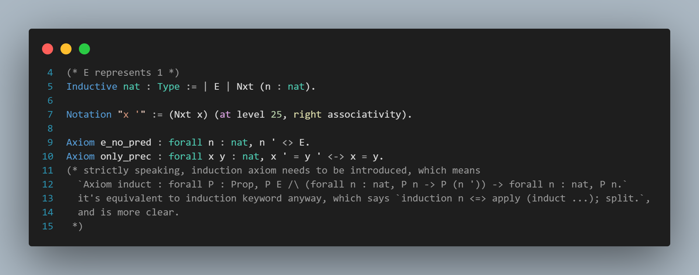
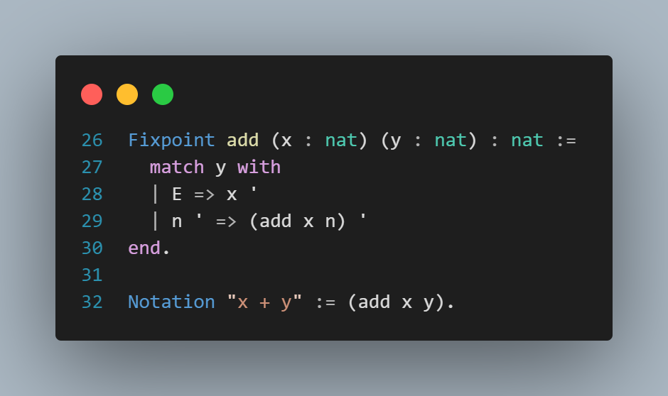
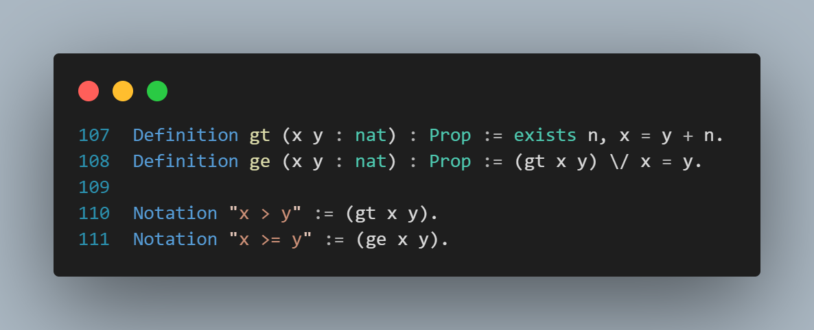
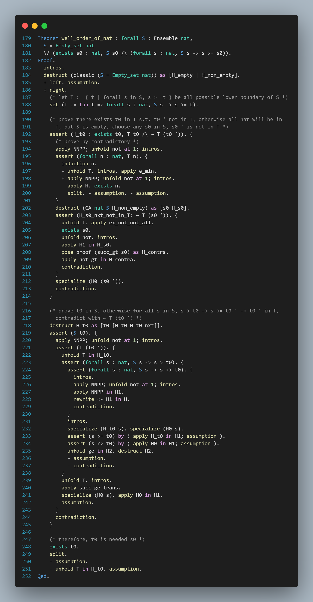

# Well Order Theorem of Nature

a toy automatic proof of self-defined Nature number and Well Order Theorem on it with Coq.

---

## **Well Order Theorem**

$\forall S \subset N, S \ne \emptyset, \exists s_0 \in S, s.t. \forall s \in S, s \ge s_0$, or informally,  any non-empty nature number set has a minimal element.

## Validate

```sh
coqc well_order_of_nat.v
```

or

```sh
echo "Print well_order_of_nat." | coqtop -l well_order_of_nat.v
```

## Core definitions and proofs






check [well_order_of_nat.v](well_order_of_nat.v) for more details.
